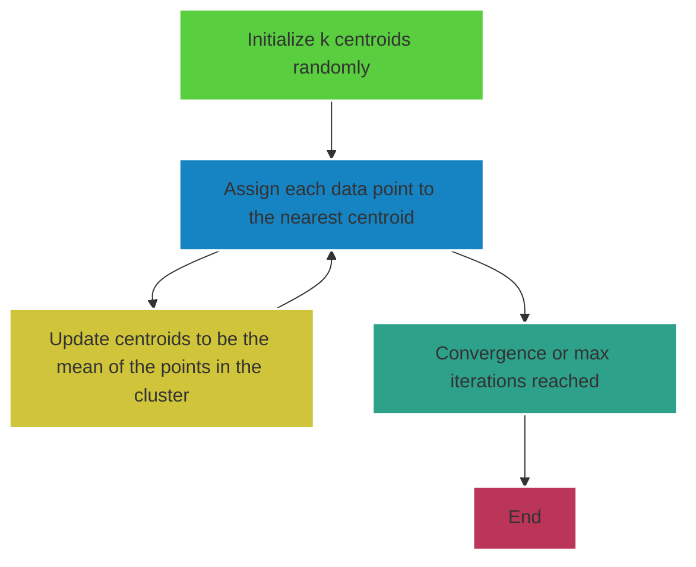

# K-means clustering algorithm  
  
__K-means clustering__ is a *Unsupervised Machine learning algorithm*, used for clustering data into a predefined number of groups. It is effective when dealing with separated data. This algorithm operates iteratively to assign each data point to one of K-clusters based on the features that are provided.  
  
## Steps  

1. __Initialization:__ Randomly select *__k__* cluster centers (*centroids*) from the data points.  

2. __Assignment Step:__ Assign each data point to nearest centroid. The *nearest* is determined using a distance metric, typically the __Euclidean Distance[^bignote]__.  
  
3. __Recompute Centroids:__ For each of the *__k__* clusters, update the cluster centroid by calculating the mean of all points assigned to the cluster.  
  
4. __Repeat:__ Repeat the Assignment and update steps until convergence is reached or a predefined number of iterations is completed.  
  

  
## Example  

__Q1. {2, 3, 8, 10, 15, 18}__  
Suppose we have *k = 2*,  
Let's randomly select initial centroids. Let's say we have *c~1~ = 3* and *c~2~ = 15*.  
  
*Assigning data points to clusters:*  
|Data Points | d(x, c~1~) = d(x,3) |d(x, c~2~) = d(x,15)| Nearest centroid|
|--|--|--|--|
| 2 | 1 | 13 | C~1~ |
| 3 | 0 | 12 | C~1~ |
| 8 | 5 | 7 | C~1~ |
| 10 | 7 | 5 | C~2~ |
| 15 | 12 | 0 | C~2~ |
| 18 | 15 | 3 | C~2~|
  
*Assignments based on initial centroids:*  

* __Cluster 1__= {2, 3, 8}  
* __Cluster 2__= {10, 15, 18}  
  
*calculating the centroids according to Assigned data points:*  
  
* $$c_1 = \frac{2 + 3 + 8}{3} = \frac{13}{3} \approx 4.33$$  
  
* $$c_2 = \frac{10 + 15 + 18}{3} = \frac{43}{3} \approx 14.33$$  
  
*Assigning data points according to updated clusters*  
|Data Points | d(x, c~1~) = d(x,4.33) |d(x, c~2~) = d(x,14.33)| Nearest centroid |
|--|--|--|--|  
| 2 | 2.33 | 12.33 | C~1~ |  
| 3 | 1.33 | 11.33 | C~1~ |  
| 8 | 3.67 | 6.33 | C~1~ |  
| 10 | 5.67 | 4.33 | C~2~ |  
| 15 | 10.67 | 0.67 | C~2~ |  
| 18 | 13.67 | 3.67 | C~2~|  

*Assignments based on updated centroids:*  

* __Cluster 1__= {2, 3, 8}  

* __Cluster 2__= {10, 15, 18}  

  *Re-calculating the centroid based on new assigned datapoint:*
* $$c_1 = \frac{2 + 3 + 8}{3} = \frac{13}{3} \approx 4.33$$  
  
* $$c_2 = \frac{10 + 15 + 18}{3} = \frac{43}{3} \approx 14.33$$  

*Since the assignments did not change, the algorithm has converged.*

*Final Cluster:*

* __Cluster 1__: {2,3,8} with centroid approximately 4.33

* __Cluster 2__: {10,15,18} with centroid approximately 14.33

[^bignote]: **Euclidean Distance Formula:**  
d(x,c) = &radic;(&sum;ni=1 (xi - ci)2)

    where:
    * **_d(x,c)_**: This denotes the Euclidean distance between two points **_x_** and **_c_**.  
    * **_x_**: represents a data point in **n**-dimensional space. In other words, **x = {x1, x2, x3,....,xn}**  
    * **_c_**: Represents a centroid or another data point that serves as a reference point in the same **_n_**-dimensional space. Similar to **_x_**, **c = {c1, c2, c3,....,cn}**  
    * **_i_**: This is an index that ranges from 1 to **_n_**, representing each component or feature of the data points **_x_** and **_c_**.
